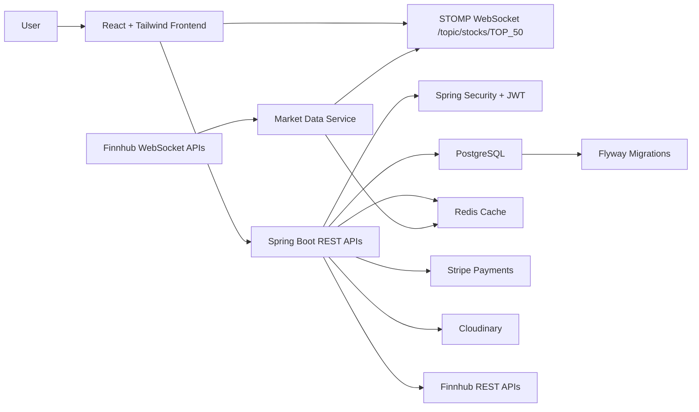

# Stock Pilot


Stock Pilot is a full-stack stock trading simulator for discovering market stocks, executing simulated buy and sell orders, managing a wallet, tracking portfolio performance, and receiving real-time price updates through WebSocket/STOMP streaming.

The project is built as a production-style trading platform with a Spring Boot backend, a React frontend, PostgreSQL persistence, Redis market-data caching, Flyway migrations, JWT-based security, Stripe wallet deposits, Cloudinary profile image storage, and Finnhub-powered market data.

Repository: [github.com/Mohan-52/stock-pilot](https://github.com/Mohan-52/stock-pilot)

## Architecture



Stock Pilot follows a layered Spring Boot architecture:

- Controller layer exposes REST endpoints for authentication, wallet, orders, trades, portfolio, and stock discovery.
- Service layer contains trading, wallet, market-data, authentication, and payment workflows.
- Repository layer uses Spring Data JPA for PostgreSQL persistence.
- Redis stores live and frequently accessed market data.
- WebSocket/STOMP streams live stock prices to subscribed frontend clients.
- Flyway owns database schema versioning.

## Key Features

- 🔐 User registration, login, JWT authentication, and protected APIs
- 📧 Email verification with OTP flow
- 👤 Profile management with Cloudinary image upload support
- 💳 Wallet system with Stripe-powered deposits
- 📈 Real-time stock prices using Finnhub and WebSocket/STOMP
- 🔎 Stock discovery and Top 50 market stock listings
- 🧾 Simulated buy and sell order execution
- 📊 Portfolio summary, position tracking, and P/L monitoring
- 🕒 Order and trade history
- ⭐ Watchlist-ready trading dashboard experience
- ⚡ Redis-backed market-data caching
- 📱 Responsive dark trading dashboard for desktop, tablet, and mobile
- 🐳 Docker Compose setup for PostgreSQL and Redis

## Technology Stack

### Backend

- Java 21
- Spring Boot
- Spring Security
- JWT Authentication
- Spring Data JPA
- PostgreSQL
- Redis
- Flyway
- WebSocket/STOMP
- Stripe Payment Gateway
- Cloudinary
- Docker

### Frontend

- React
- TypeScript-ready frontend structure
- Tailwind CSS
- Axios
- STOMP/WebSocket
- Vite

### External Integrations

- Finnhub REST APIs
- Finnhub WebSocket APIs
- Stripe Checkout / Payment Intents
- Cloudinary Image Storage

## Project Structure

```text
stock-pilot/
|-- backend/
|   |-- docker-compose.yml
|   |-- pom.xml
|   `-- src/
|       |-- main/
|       |   |-- java/com/mohan/stock_pilot/
|       |   |   |-- auth/
|       |   |   |-- common/
|       |   |   |-- config/
|       |   |   |-- marketdata/
|       |   |   |-- orders/
|       |   |   |-- portfolio/
|       |   |   |-- security/
|       |   |   `-- wallet/
|       |   `-- resources/
|       |       |-- application.yml
|       |       `-- db/migration/
|       `-- test/
|-- frontend/
|   |-- package.json
|   |-- vite.config.js
|   `-- src/
|       |-- app/
|       |-- components/
|       |-- contexts/
|       |-- features/
|       |   |-- auth/
|       |   |-- dashboard/
|       |   |-- trading/
|       |   `-- wallet/
|       |-- services/
|       |-- types/
|       `-- utils/
`-- README.md
```

## Database and Redis

PostgreSQL is the source of truth for users, roles, wallets, wallet transactions, instruments, positions, orders, and trades. Flyway migrations in `backend/src/main/resources/db/migration` version and apply database changes automatically when the backend starts.

Redis is used as a high-speed market-data cache. Live stock prices and frequently requested market data can be stored and retrieved without repeatedly calling external APIs, reducing latency and protecting external API rate limits.

Docker Compose provides local PostgreSQL and Redis services:

- PostgreSQL: `localhost:5433`
- Redis: `localhost:6379`
- Default database: `stock_pilot`

## Finnhub Integration

Stock Pilot integrates with Finnhub in two ways:

- REST APIs are used for stock discovery, company/instrument data, and market metadata.
- WebSocket APIs are used to receive live market price ticks.

The backend normalizes Finnhub responses into internal DTOs, caches market data in Redis, persists relevant instrument data in PostgreSQL, and publishes live stock updates to frontend clients over STOMP.

## Stripe Payment Workflow

The wallet deposit flow uses Stripe Payment Intents:

1. The user enters a wallet deposit amount in the frontend.
2. The frontend requests a payment intent from the backend.
3. The backend creates the payment intent using Stripe secret credentials.
4. The frontend confirms the card payment using the Stripe publishable key.
5. Stripe sends payment events to the backend webhook.
6. The backend processes successful payments and updates the user's wallet balance.

Sensitive Stripe secrets are stored only on the backend. The frontend uses only the publishable key.

## WebSocket Real-Time Updates

The backend exposes a SockJS/STOMP endpoint:

```text
/ws-stock
```

The frontend subscribes to:

```text
/topic/stocks/TOP_50
```

When Finnhub sends live price ticks, the backend publishes normalized stock updates to this topic. The React frontend merges incoming messages into local stock state so prices update on screen without a page refresh.

## Setup Instructions

### 1. Clone the Repository

```bash
git clone https://github.com/Mohan-52/stock-pilot.git
cd stock-pilot
```

### 2. Start PostgreSQL and Redis

```bash
cd backend
docker compose up -d
```

### 3. Backend Environment Variables

Create environment variables for the backend runtime:

```env
ACCESS_SECRET=your_access_token_secret
REFRESH_SECRET=your_refresh_token_secret
ACCESS_EXPIRATION=3600000
REFRESH_EXPIRATION=604800000

FINNHUB_API_KEY=your_finnhub_api_key

STRIPE_SECRET_KEY=your_stripe_secret_key
STRIPE_WEBHOOK_SECRET=your_stripe_webhook_secret

CLOUDINARY_CLOUD_NAME=your_cloudinary_cloud_name
CLOUDINARY_API_KEY=your_cloudinary_api_key
CLOUDINARY_API_SECRET=your_cloudinary_api_secret

GMAIL_ID=your_email@gmail.com
GMAIL_APP_PASSWORD=your_gmail_app_password
```

The default local database and Redis values are already configured in `backend/src/main/resources/application.yml`.

### 4. Run the Backend

From the `backend` directory:

```bash
./mvnw spring-boot:run
```

On Windows:

```bash
mvnw.cmd spring-boot:run
```

The backend runs on:

```text
http://localhost:8080
```

### 5. Frontend Environment Variables

Create `frontend/.env`:

```env
VITE_STRIPE_PUBLISHABLE_KEY=your_stripe_publishable_key
```

### 6. Run the Frontend

```bash
cd frontend
npm install
npm run dev
```

The frontend runs on:

```text
http://localhost:5173
```

## API Overview

| Area | Endpoint Group | Description |
| --- | --- | --- |
| Authentication | `/api/auth/register` | Register a new user |
| Authentication | `/api/auth/login` | Login and receive JWT credentials |
| Email Verification | `/api/auth/registration/otp/send` | Send registration OTP |
| Email Verification | `/api/auth/registration/otp/resend` | Resend OTP |
| Email Verification | `/api/auth/registration/otp/verify` | Verify OTP |
| Profile | `/api/me` | Get current user profile |
| Profile | `/api/profile` | Update user profile |
| Stocks | `/api/stocks` | Fetch popular stocks, including Top 50 |
| Instruments | `/api/instruments/sync` | Sync instrument data |
| Portfolio | `/api/portfolio` | Get portfolio data |
| Portfolio | `/api/portfolio/summary` | Get portfolio summary |
| Portfolio | `/api/portfolio/positions` | Get paginated positions |
| Orders | `/api/orders/buy` | Place simulated buy order |
| Orders | `/api/orders/sell` | Place simulated sell order |
| Orders | `/api/orders` | Get order history |
| Trades | `/api/trades` | Get trade history |
| Wallet | `/api/wallet` | Create or fetch wallet |
| Wallet | `/api/wallet/transactions` | Get wallet transaction history |
| Payments | `/api/payments/create-intent` | Create Stripe payment intent |
| Payments | `/api/payments/webhook` | Stripe webhook handler |
| WebSocket | `/ws-stock` | SockJS/STOMP connection endpoint |
| Live Prices | `/topic/stocks/TOP_50` | STOMP subscription topic |

## Screenshots

Add screenshots to a `docs/screenshots` folder and replace these placeholders:

### Trading Dashboard


### Stock Detail


### Portfolio


### Wallet


## Future Enhancements

- Advanced watchlist management
- Candlestick charts and technical indicators
- Portfolio allocation charts
- Real-time order book simulation
- Better market session awareness
- Notification center for order execution and price alerts
- Admin dashboard for instrument and user management
- CI/CD pipeline with automated tests and deployment
- Dockerized full-stack production deployment

## Contributing

Contributions are welcome.

1. Fork the repository.
2. Create a feature branch.
3. Commit your changes with clear messages.
4. Push your branch.
5. Open a pull request with a concise description and screenshots when UI changes are included.

Please keep backend API contracts stable unless the change is intentional and documented.

## License

This project is intended for educational and portfolio use. Add your preferred license file, such as MIT, before distributing or reusing the project commercially.

---

Built by [Mohan](https://github.com/Mohan-52) as a full-stack trading simulator project.
